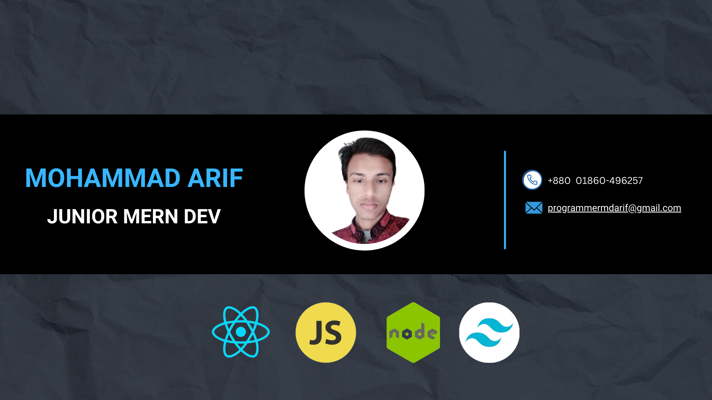

<!--  -->

<h1 align="center">Hi there! 👋 I'm Arif</h1>
<h3 align="center">A Full Stack Developer passionate about building interactive website</h3>

# 💫 About Me:

👋 Hi there! I'm Arif, a frontend developer from Bangladesh 🇧🇩 passionate about creating intuitive user interfaces and solving challenges in web development.

<!-- 🌟 **Skills:** Proficient in the MERN stack - MongoDB, Express, React, Node.js. Skilled in frontend design with CSS, JavaScript,, and React.
  
🚀 **Passion:** Eager to learn and innovate, a fast learner, and a team player committed to delivering high-quality solutions.

🚀 **Vision:** Striving to evolve into a full-stack developer contributing significantly to a company's success, combining frontend finesse with backend expertise.

💻 I specialize in building dynamic web applications using MongoDB, Express, React, and Node.js. From server-side logic to seamless client-side interactions, I love diving into the intricacies of web development.

🔍 Currently open to exciting opportunities to grow, learn, and contribute as part of a dynamic team.
 -->
  # 📊 GitHub Stats:

 
  
   
  

  <!-- <h3>✍️ Random Dev Quote</h3>
   -->

  

  

# 🌐 Socials Link:

# 💻 Tech Stack:
<!--         

   
   -->

<table align="center">
  <tr>
    <td align="center" width="96">
        
       React
    </td>
    <td align="center" width="96">
        
       JavaScript
    </td>
    <td align="center" width="96">
        
       TypeScript
    </td>
    <td align="center" width="96">
        
       MongoDB
    </td>
    <td align="center" width="96">
        
       Node JS
    </td>
    <td align="center" width="96">
      
       Rest API
    </td>
    <td align="center" width="96">
        
       Next JS
    </td>
    <td align="center" width="96">
        
       Express JS
    <td align="center" width="96">
        
       VSCode
    </td>
  </tr>
  <tr>
    <td align="center" width="96">
        
       Firebase
    </td>
    <td align="center" width="96">
        
       Figma
    </td>
    <td align="center" width="96">
        
       Netlify
    </td>
    <td align="center" width="96">
        
       Tailwind CSS
    </td>
      <td align="center" width="96">
        
       Bootstrap
    </td>
     <td align="center" width="96">
        
       HTML5
    </td>
    <td align="center" width="96">
        
       CSS3
    </td>
  </tr>

</table>

  ## 💰 You can help me by Donating
   

  
<!-- Proudly created with GPRM ( https://gprm.itsvg.in ) -->
